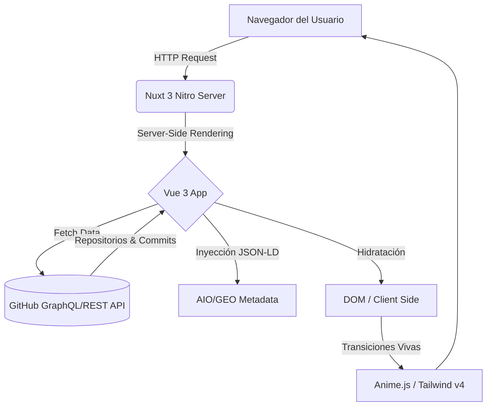

<div align="center">
  
  <h1>Juan Miguel Ruiz | Dev Portfolio 🚀</h1>
  
  <blockquote>
    <i>"Un código afilado como Wado Ichimonji. Sin movimientos en falso."</i> ⚔️<br/>
    <b>Portafolio personal ultra-rápido, optimizado con AIO/GEO y JSON-LD.</b>
  </blockquote>
  
  <p>
    <a href="https://bun.sh"></a>
    <a href="https://nuxt.com"></a>
    <a href="https://vuejs.org/"></a>
    <a href="https://animejs.com/"></a>
    <a href="https://tailwindcss.com/"></a>
  </p>
  
  <p>
    
    
    
    
  </p>

  <p>
    
    
    
  </p>
</div>

<br />

## 📖 Tabla de Contenidos

1. [🌟 Sobre el Proyecto](#-sobre-el-proyecto)
2. [✨ Características Principales & AIO/GEO](#-características-principales--aiogeo)
3. [🖼️ Showcase & UI](#️-showcase--ui)
4. [📐 Arquitectura & Diagrama](#-arquitectura--diagrama)
5. [🛠️ Stack Tecnológico](#️-stack-tecnológico)
6. [🚀 Instalación (Strictly Bun)](#-instalación-strictly-bun)
7. [🧠 Zettelkasten Knowledge Base](#-zettelkasten-knowledge-base)

---

## 🌟 Sobre el Proyecto

Este repositorio alberga mi identidad digital. Más que un portafolio, es un demostrador técnico forjado con la disciplina de un samurái del frontend. Cada componente ha sido extraído, modularizado y estilizado con *Armament Haki* para lograr una UI inquebrantable, responsiva y accesible.

El diseño está enfocado en una **excelente experiencia de usuario (UX)**, con micro-interacciones pulidas y animaciones dinámicas, todo potenciado por el motor de **Nuxt 3**.

---

## ✨ Características Principales & AIO/GEO

| Feature | Descripción |
| :--- | :--- |
| ⚡️ **Rendimiento Extremo** | Renderizado del lado del servidor (SSR), optimización agresiva de imágenes y un bundle cortado en pedazos para ser súper ligero. |
| 🧠 **AIO & GEO Optimization** | **NUEVO:** Optimizado para AI Overview (AIO) y Generative Engine Optimization (GEO). Usamos `JSON-LD` semántico estructurado a la perfección para dominar métricas de LLMs y buscadores. |
| 🎨 **UI/UX Premium** | Diseño neo-brutalista moderno, minimalista, con sistema de tokens para una adaptación orgánica (Tailwind + Animaciones fluidas). |
| 🌗 **Modo Oscuro/Claro** | Transiciones suaves de tema gestionadas nativamente sin bloqueos. |
| 🌍 **Multilenguaje (i18n)** | Soporte total en Español (ES) e Inglés (EN) listo para crecer. |
| 📦 **GitHub API Integration** | Consumo dinámico de mis repositorios. El código habla por mí, actualizándose en tiempo real. |

---

## 🖼️ Showcase & UI

<table align="center" style="width: 100%; border-collapse: collapse;">
  <tr>
    <td align="center" width="50%">
      <b>Vista Desktop (Ultra-wide Ready)</b><br/><br/>
      
    </td>
    <td align="center" width="50%">
      <b>Optimización Móvil Orgánica</b><br/><br/>
      
    </td>
  </tr>
</table>

*(Screenshots generados de los iconos de la PWA del proyecto como placeholder representativo del estilo general)*

---

## 📐 Arquitectura & Diagrama

Corté la deuda técnica y unifiqué el flujo de datos. **Nuxt 3 Nitro** orquesta las requests del lado del servidor, y entrega a Vue la tarea de hidratar y controlar el DOM reactivo.



<details>
<summary><b>📂 Ver Estructura de Carpetas (Directory Tree)</b></summary>
<br>

```bash
📦 portafolio-Juan-Ruiz
 ┣ 📂 assets
 ┃ ┣ 📂 css        # Tokens globales de Tailwind
 ┃ ┗ 📂 img        # Activos visuales fijos
 ┣ 📂 components   # Modularizados con estilo Santoryu
 ┃ ┣ 📂 ui         # Botones, Inputs, Modales aislados
 ┃ ┣ 📂 layout     # Header, Footer, Wrappers
 ┃ ┗ 📜 Hero.vue   # Componente base
 ┣ 📂 composables  # Lógica TS extraída y limpia
 ┃ ┗ 📜 useGitHub.ts
 ┣ 📂 pages
 ┃ ┗ 📜 index.vue  # Raíz hidratada
 ┣ 📂 public       # Archivos estáticos y PWA manifest
 ┣ 📂 server       # Endpoints Nitro (Backend for Frontend)
 ┣ 📜 nuxt.config.ts
 ┣ 📜 package.json
 ┣ 📜 bun.lockb    # Bloqueo estricto de BUN
 ┗ 📜 README.md    # Estás aquí
```

</details>

---

## 🛠️ Stack Tecnológico

| Dominio | Tecnología Base |
| :--- | :--- |
| **Framework Base** | Nuxt 3 + Vue 3 (Composition API) |
| **Styling & UI** | Tailwind CSS v4 |
| **Tipado Estricto** | TypeScript |
| **Motion & Dynamics** | Anime.js + Vue Transitions |
| **Icons & Assets** | Nuxt UIcons (`heroicons`, `ph`) |
| **Engine & Scripts** | **Bun** 🥟 |

---

## 🚀 Instalación (Strictly Bun)

En este dojo, la ley es estricta: **`npm` y `yarn` están prohibidos.** Todo corre sobre `bun` para evitar cuellos de botella y arrancar proyectos a la velocidad del rayo.

### 1. Clonar el repositorio
```bash
git clone https://github.com/juankio/portafolio-Juan-Ruiz.git
cd portafolio-Juan-Ruiz
```

### 2. Instalar dependencias
```bash
bun install
```

### 3. Configurar variables de entorno (Opcional)
Si necesitas expandir los límites de la API de GitHub, crea un archivo `.env`:
```bash
echo "GITHUB_TOKEN=tu_token_personal_aqui" > .env
```

### 4. Modo Desarrollo
Levanta la interfaz y observa cómo cobra vida:
```bash
bun run dev
```
> El proyecto estará corriendo y afilado en `http://localhost:3000`

### 5. Compilación para Producción
```bash
bun run build
# Para previsualizar el código compilado:
bun run preview
```

---

## 🧠 Zettelkasten / Knowledge Base

Como parte de la disciplina del desarrollador y la persistencia de las arquitecturas generadas, este README conecta directamente a mi **Cerebro Digital (Obsidian Vault)**:

- 🔗 `[[Estrategia-GEO-AIO-Portafolio]]` - Notas y decisiones sobre la implementación del JSON-LD y optimización para Inteligencia Artificial.
- 🔗 `[[Auditoria-Portafolio-Robin]]` - Registros de las pruebas de seguridad, QA visual, score audit y performance.

---

<div align="center">
  
  <br/>
  <sub>Desarrollado con técnica de Tres Espadas (Santoryu) por <b>Juan Miguel Ruiz</b></sub>
  <br/>
  <a href="https://www.linkedin.com/in/juan-miguel-ruiz-300037276/">LinkedIn</a> • <a href="https://github.com/juankio">GitHub</a>
</div>
